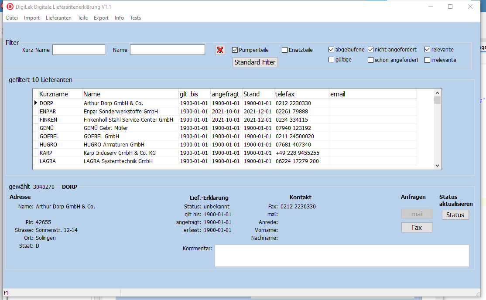
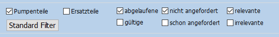
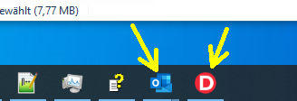
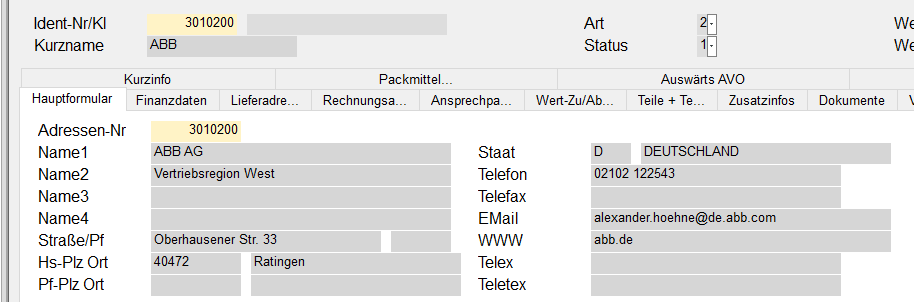
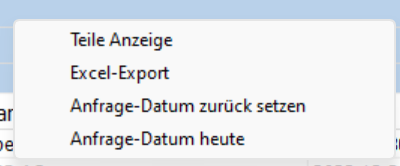
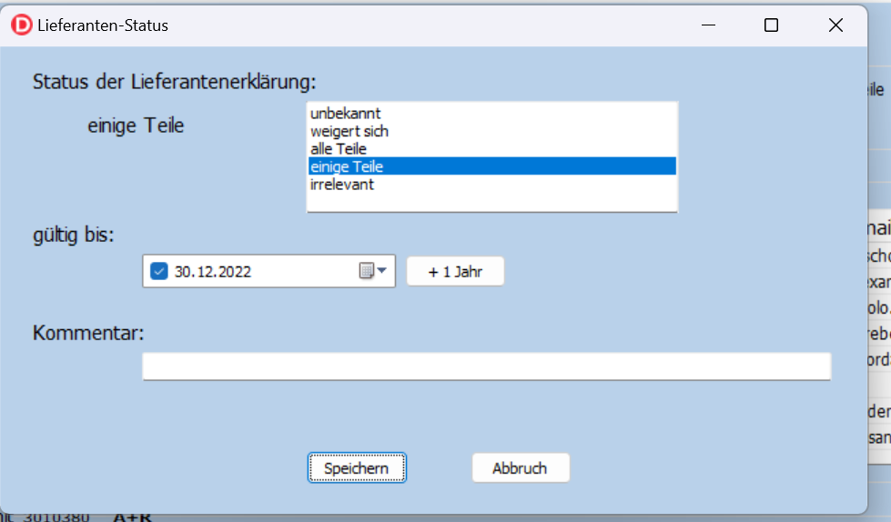
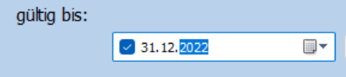
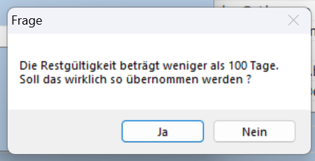

Aufgaben und Formulare
======================

Daten einlesen
--------------

Das Programm dient zur digitalen Erfassung von Lieferantenerklärungen.

.. index::
   single: Anforderung

.. _LeklAnnfordern:

Lieferantenerklärungen anfordern
--------------------------------
Zuerst müssen die relevanten Lieferanten aufgefordert werden, eine Langzeit-Lieferantenerklärung
abzugeben.

Dabei sind Ersatzteil-Lieferanten bevorzugt abzuarbeiten.

Die Anforderung erfolgt über das Menü "Lieferanten" Untermenü "Erklärungen anfordern/eingeben".

Das Formular gliedert sich in die Bereiche "Filter", "gefiltert" und "gewählt".

Im Bereich Filter wird definiert, welche Lieferanten im Bereich gefiltert zur Auswahl angezeigt werden.

Der im Bereich "gefiltert" angewählte Lieferant wird mit Detailangaben im Bereich "gewählt" angezeigt.
Auf diesen Datensatz wirken sich die im Bereich "gewählt" möglichen Aktionen aus.

.. _AnfrageFilter:

Formular-Bereich Filter
^^^^^^^^^^^^^^^^^^^^^^^

Die Filter dienen dem leichteren Auffinden eines Lieferanten bzw. der Kontrolle,
welche Lieferanten noch zu bearbeiten sind.

.. image:: pics/LeklAnfordernFilterLinks.png
   :scale: 50 %
   :align: center

Im linken Bereich kann über den Kurznamen oder den kompletten Namen gefiltert werden.
Dabei wird z.B. durch die Eingabe von *oduct* im Feld Name der Lieferant "B&P Products BVBA" gefunden.

Die Filter wirken alle gleichzeitig.
In der Überschrift des "gefiltert"-Bereichs wird jeweils angezeigt, wie viele Lieferanten den Kriterien entsprechen. 

Über die Schaltfläche mit dem durchkreutzten Filter-Symbol werden die Filter für Kurz-Name und Name gelöscht.

Wird ein Haken im Kästchen **Pumpenteile** gesetzt, werden nur Lieferanten angezeigt, die Pumpenteile liefern.
Ohne diesen Haken werden alle Lieferanten angezeigt, unabhängig davon, ob sie Pumpenteile liefern oder nicht.

Analog wirken alle anderen Kästchen. Bei den sechs Filtern rechts, gibt es jeweils einen Filter und
den passenden Umkehrfilter dazu.

So werden über den Filter **irrelevante** nur Lieferanten angezeigt, deren Status auf "irrelevant"
gesetzt wurde. Der Filter **relevante** zeigt also Lieferanten deren Status nicht "irrelevant"
ist. Dieser Filter ist nützlich, damit Lieferanten nicht mehr angezeigt werden, für die bereits entschieden wurde,
das sie keine Lekl abgeben sollen (s.auch :ref:`StatusRef`).

Der Filter **abgelaufene** zeigt nur Lieferanten, deren Lekl in weniger als 300 Tagen ungültig wird.
Die Gültigkeit der *alten* Lekl wird als "gilt_bis" in den Bereichen "gefiltert" und "gewählt" angezeigt.
Es werden jedoch zusätzliche 300 Tage gefordert, weil bei der Datenübertragung nach UNIPPS
die zugrunde liegende Erklärung noch mindestens so lange gelten soll.
Die als **abgelaufen** gefilerten Erklärungen **müssen** daher neu angefordert werden.
Der mit dem Filter **gültige** gefilterten Erklärungen gelten noch mehr als 300 Tage und 
müssen daher nicht neu angefordert werden.

Der Filter **nicht angefordert** zeigt nur Lieferanten, 
die zuletzt vor mehr als 200 Tagen um die Abgabe einer Lekl gebeten wurden.
Das Datum der letzten Anfrage wird als "angefragt" in den Bereichen "gefiltert" und "gewählt" angezeigt.
Es werden jedoch zusätzliche 200 Tage gefordert, um die Anfragen aus dem Vorjahr auszuklammern.
"Nicht angefordert" bezieht sich also auf den aktuellen Erfassungsablauf, 
der ca. im November eines Jahres beginnt und im Januar des Folgejahres abgeschlossen sein sollte.
Der Umkehrfilter **schon angefordert** zeigt entsprechend Lieferanen, 
die vor weniger als 200 Tagen um die Abgabe einer Lekl gebeten wurden.
Diese Liefernten müssen aktuell nicht aufgefordert werden.

Die Aufgabe **Lieferantenerklärungen anfordern** ist daher abgeschlossen,
wenn bei gesetzten Filtern **Ersatzteile** (oder idealerweise **Pumpenteile**) und 
**abgelaufene** und **nicht angefordert** und **relevante** keine Lieferanten mehr angezeigt werden.

Formular-Bereich gefiltert
^^^^^^^^^^^^^^^^^^^^^^^^^^

In diesem Bereich werden alle Lieferanten zur Auswahl angeboten, die den Filterkriterien entsprechen.

In der Überschrift des Bereiches wird die Anzahl dieser Lieferanten angezeigt.

Die Detailangaben des in diesem Bereich angewählten Lieferanen werden im Bereich **gewählt** angezeigt.

Formular-Bereich gewählt
^^^^^^^^^^^^^^^^^^^^^^^^

Dieser Bereich dient zur eigentlichen Bearbeitung des Lieferanten,
der im Bereich **gefiltert** ausgewählt wurde.

In der Bereichsüberschrift werden die UNIPPS-Lieferanten-Id und der Kurzname angezeigt.

Unter der Überschrift **Adresse** werden die Adressdaten der Lieferfirma aus dem Hauptformular der UNIPPS-Shell
**Lieferanten** (s. :ref:`Ansprechpartner`) angezeigt.

Unter der Überschrift **Liefer.-Erklärung** werden angezeigt:

- **Status**: Der grundlegende Zustand der Lekl (s.  :ref:`StatusRef`)
- **gilt_bis**: Das Gültigkeitsdatum der aktuellen Lekl
- **angefragt**: Das Datum der letzten Anfrage an der Lieferanten bzgl einer Lekl
- **erfasst**:  Das Datum an den der Status eingeben wurde

Unter der Überschrift **Kontakt** wird der Adressat (s. :ref:`Ansprechpartner`) einer Lekl-Anfrage angezeigt.

Der angezeigte Lieferant kann mit den Aktionen 
"mail" (s.  :ref:`mail`) bzw "Fax" (s.  :ref:`fax`) aufgefordert werden,
eine Lekl abzugeben. Dabei sind die Aktionen nur verfügbar, 
wenn entsprechende Adressen (mail oder Fax) in UNIPPS hinterlegt sind.

Das Feld **Kommentar** ermöglicht die Eingabe von Bemerkungen zum Lieferanten.
Dieses Feld kann auch über den Dialog zur Statuseingabe ausgefüllt werden.

Mit der Aktion "Status" kann der Zustand des Lieferanten bezüglich einer Lekl erfasst werden.
Dies dient hauptsächlich der Erfassung der Rückmeldungen. 

Es kann aber auch im Vorfeld über den Status "irrelevant" vermerkt werden, 
dass diesem Lieferanten keine Anfrage nach einer Lekl geschickt werden soll (s. :ref:`StatusRef`).
Lieferanten mit diesem Status können durch einen entsprechenden Filter 
von der weiteren Bearbeitung ausgeschlossen werden.

.. _mail:

mail versenden
^^^^^^^^^^^^^^

Bei Auswahl von mail öffnet sich ein Outlook-Fenster mit einer vorbereiteten mail an den hinterlegten
Ansprechpartner. Die mail wird aus einer Vorlage in einem speziellen Outlook-Ordner des Digilek-Benutzers erzeugt
und mit den Kontaktdaten des Ansprechpartners ergänzt.

.. image:: pics/mailBestaetigung.png
   :scale: 80 %
   :align: center

Durch DigiLek wird ein Dialog angezeigt, der zur Kontrolle der mail auffordert.
Ist die mail korrekt, kann sie mit dem Dialog verschickt werden.
In diesem Fall wird das aktuelle Datum als **angefragt** in der Datenbank eingetragen.

Ist die mail fehlerhaft, kann sie in Outlook korrigiert und über den Dialog verschickt werden.
Alternativ kann die mail über den Dialog gelöscht werden.
Das Datum **angefragt** wird dann nicht aktualisiert.

Die mail **muss** auf jeden Fall mit dem DigiLek-Dialog und **nicht** mit Outlook verschickt oder gelöscht werden.

Damit der geschilderte Ablauf reibungslos abläuft, sollten alle Windows-Fenster außer DigiLek und Outlook
geschlossen oder minimiert werden.

Ist ein benötigtes Outlook- oder DigiLek-Fenster nicht sichtbar, kann es über die Windows-Taskleiste
am unteren Bildschirmrand in den Vordergrung geholt werden.

.. _fax:

Fax versenden
^^^^^^^^^^^^^

Das Versenden eines Fax läuft analog zur mail.

Es wird per MS-Word ein Musterfax geöffnet und mit den Kontaktdaten des Ansprechpartners ergänzt.

Das Musterfax ist in **V:\Tools\Lieferantenerklaerung\Vorlagen** hinterlegt.
Es heißt Fax_Muster_Kiel.docx

Das Fax wird geprüft, evtl per Word korrigiert und **immer** per DigiLek-Dialog gedruckt oder gelöscht.
Im Fall des Drucks, wird das aktuelle Datum als **angefragt** in der Datenbank eingetragen.

.. _Anfragedatum:

Das Anfragedatum
^^^^^^^^^^^^^^^^
Das Datum der Anfrage (Datenbank-Feld **angefragt**) ist wesentlich für die Kontrolle, 
ob alle nötigen Lieferanten angefragt wurden (s.  :ref:`Filter<AnfrageFilter>`).

Sollte beim oben beschriebenen Ablauf ein Fehler enstehen, weil z.B. eine mail 
oder ein Fax nicht zustellbar waren, muss das Datum **angefragt** in der Datenbank zurück gesetzt werden.

Dies erfolgt mit dem Rechte-Maustasten-Menü **Anfrage-Datum zurück setzen** (s. :ref:`RMausMenueAnfragen`).
Hiermit wird das Datum um 1 Jahr zurückgesetzt.

Umgekehrt kann mit dem Menüpunkt  **Anfrage-Datum heute** das Datum auf den aktuellen Tag gesetzt werden.

Die Befehle wirken sich jeweils auf den gewählten Lieferanten aus.

.. _Ansprechpartner:

Ansprechpartner
^^^^^^^^^^^^^^^
In UNIPPS kann bei den Lieferanten ein spezieller Ansprechpartner hinterlegt werden,
dessen Adresse für die Anfrage einer Lekl verwendet wird. 
Hierzu wird in der Lieferanten-Shell im Feld **Klassifizierung** des Formulars **Ansprechpartner**
der Begriff **LEKL** eingetragen.

.. image:: pics/AnsprechpartnerLEKL.png
   :scale: 80 %
   :align: center

Ist das Feld Klassifizierung bereits anderweitig mit Informationen belegt, kann LEKL hinzugefügt werden,
also z.B.: "blabla;LEKL".

Ist kein spezieller Ansprechpartner markiert, so werden mail-Adresse und Fax-Nr aus dem UNIPPS-Hauptformular entnommen.

.. index::
   single: Statuseingabe

.. _RMausMenueAnfragen:

Rechte-Maustasten-Menue
^^^^^^^^^^^^^^^^^^^^^^^

Im gesamten Formular kann mit der rechten Maustaste das folgende Menü aufgerufen werden:

Es enthält die Einträge:

- **Teile Anzeige**: Zeigt in einem neuen Formular alle Teile, die der gewählte Lieferant geliefert hat.
- **Excel-Export**: Überträgt alle gefilterten Lieferanten nach Excel.
- **Anfrage-Datum zurück setzen**: Setzt das Datum der Anfrage (Datenbank-Feld **angefragt**, s.  :ref:`Anfragedatum`) um 1 Jahr zurück.
- **Anfrage-Datum heute**: Setzt das Datum der Anfrage auf den aktuellen Tag.

Erfassen des Status eines Lieferanten
-------------------------------------

.. _StatusRef:

Zur Erfassung des Status dient das gleiche Formular, das zum Anfordern der Lekl verwendet wird.
Es wird über das Menü "Lieferanten" Untermenü "Erklärungen anfordern/eingeben" aufgerufen.

Die Auswahl, des zu bearbeitenden Lieferanten erfolgt daher, wie unter :ref:`LeklAnnfordern` beschrieben.

Mit der Schaltfläche **Status** kann dann der Dialog zur Eingabe aufgerufen werden.

Status
^^^^^^

Der Lieferanten-Status erfasst den generellen Zustand des Lieferanten bzgl. einer Lekl.
Dabei gibt es folgende Möglichkeiten:

#. **unbekannt**: Der Lieferant wurde noch nie angefragt.
#. **weigert sich**: Der Lieferant kann keine Lekl abgeben, oder will Geld dafür und wir verzichten. 
#. **alle Teile**: Der Lieferant bestätigt den EU-Ursprung für alle Teile, die er an uns liefert.
#. **einige Teile**: Der Lieferant bestätigt den EU-Ursprung für bestimmte Teile, die er an uns liefert.
#. **irrelevant**: Es wurde entschieden, diesen Lieferanten nicht um eine Lekl zu bitten.

Der Status **unbekannt** wird bei neuen Lieferanten von DigiLek vorgegeben und sollte nie vom Anwender vergeben werden.

Der Status **irrelevant** wird vergeben, wenn der Lieferant nicht bzgl Lekl angefragt werden soll, obwohl er Pumpen- oder Ersatzteile liefert.
Durch Vergabe dieses Status wird diese bewusste Entscheidung dokumentiert.
Damit kann vermieden werden, das der Lieferant immer wieder in den Auswahllisten auftaucht, obwohl er keine Anfrage bekommen soll.
Bei Vergabe von **irrelevant** **sollte** auf jeden Fall eine Begründung im Formularfeld **Kommentar** abgegeben werden.

Status 2 bis 4 beschreiben die Rückmeldung des Lieferanten.

Sind in der abgegebenen Erklärung einzelne Teile aufgelistet, für die der Lieferant 
den EU-Ursprung garantiert, wird der Status **einige Teile** vergeben.

Bestätigt der Lieferant den EU-Ursprung, für alle Teile, die er an uns liefert, 
wird der Status **alle Teile** vergeben.

Nur in diesem Fall muss im weiteren Ablauf die Präferenzberechtigung für jedes einzelne Teil 
erfasst werden (:ref:`ErfassenTeilespeLekl`). In allen anderen Fällen ist die Erfassung für diesen Lieferanten abgeschlossen.

Die Erfassung des Status erfolgt über den folgenden Dialog:

Im oberen rechten Formularbereich kann der zukünftige Status ausgewählt werden.
Links daneben wird der bisherige Stauts angezeigt.

Im Bereich **gültig bis** wird die bisher in der Datenbank hinterlegte Gültigkeit der Lekl angezeigt.
Hat der Lieferant eine neue Lekl abgegeben, **muss** dieses Datum aktualisiert werden.

In der Regel kann die Gültigkeit um 1 Jahr verlängert werden (Schaltfläche **+ 1 Jahr**).
Exakte Angaben eines anderen Datums können direkt in der Datumsanzeige erfolgen:

Hierzu kann z.B. die Jahreszahl, der Tag oder Monat angeklickt und überschrieben werden.

Die Datumseingabe ist bei den Status "**alle Teile**" und "**einige Teile**" erforderlich.
In diesen Fällen wird beim Verlassen des Formulars geprüft, ob die die Gültigkeit mindestens 100 Tage beträgt.
Ist dies nicht der Fall, wurde evtl vergessen, das Datum anzupassen und es erscheint eine Sicherheitsabfrage:

Wird die Frage mit **Nein** beantwortet, wird das Formular nicht geschlossen und das Datum kann korrigiert werden. 
Mit **Ja** werden die Angaben in die Datenbank übernommen.

Wird der Status **weigert sich** oder **irrelevant** gewählt, solltes die im Feld **Kommentar** begründet werden.
Der Kommentar kann auch im Hauptformular eingeben werden.

.. _ErfassenTeilespeLekl:

Erfassen der teilespezifischen Lieferantenerklärungen
-----------------------------------------------------

Die Eingabe der teilespezifischen Lieferantenerklärungen wird über das Menü Teile/sss
gestartet. Hierzu wird zunächst der Lieferant ausgewählt, dessen Erklärung erfasst werden soll.

.. index::
   single: Lieferantenauswahl 

Auswahl eines Lieferanten zur teilespezifischen Eingabe
^^^^^^^^^^^^^^^^^^^^^^^^^^^^^^^^^^^^^^^^^^^^^^^^^^^^^^^

.. image:: pics/Lekl3LieferantenAuswahl.png

.. index::
   single: Präferenzkenner

Setzen der PFK-Flags
^^^^^^^^^^^^^^^^^^^^

.. image:: pics/TeilePFKeingeben.png

Bereitstellung der Daten zum Export
-----------------------------------

Sind alle Erklärungen erfasst, muss abschließend über das Menü Export
eine Auswertung gestartet werden, die auch die Daten für den Export nach UNIPPS erzeugt. 
