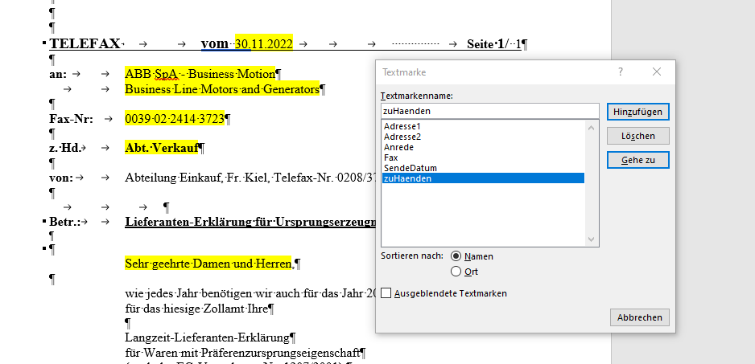
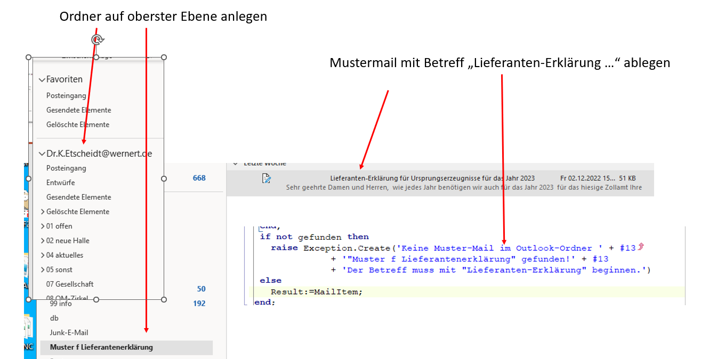

Installation
============

DigiLek.exe kann in ein beliebiges Verzeichnis kopiert werden.

Dieses Verzeichnis muss dann jedoch folgende Unterverzeichnisse enthalten:

- db: Datenbank-Verzeichnis zur Aufnahme der Access-Datenbank "LieferErklaer.accdb"
- Hilfe: zur Aufnahme der Hilfe-Datei "digilekdoc.chm"
- Vorlagen: zur Aufnahme der Word-Faxvorlagen und des Vordruckes "LLE Formular.pdf"

Vorlagen
--------

Im Verzeichnis Vorlagen muss je Benutzer ein Word-Dokument hinterlegt sein,
welches den Text enthält, mit dem Lieferanten zur Abgabe einer Lieferantenerklärung
aufgefordert werden.

Der Name Fax_Muster_*username*.pdf beinhaltet den Windows-Usernamen des Benutzers.

Das Dokument muss diverse Textmarken enthalten, deren Texte von DigiLek ersetzt werden.

Outlook
-------

Um Anfragen per mail zu verschicken, muss in Outlook ein mail-Entwurf abgelegt werden.

Dieser muss im Betreff mit "Lieferanten-Erklärung" beginnen
und im Ordner "Muster f Lieferantenerklärung" abgelegt werden, 
der direkt auf der obersten Ebene des Benutzer-Postfachs liegen muss.

Der mail body muss mit "Sehr geehrte Damen und Herren," beginnen,
da dieser Text von DigiLek ersetzt wird.

Hilfe
-----

Da die Hilfe-Datei auf Netzlaufwerken nicht korrekt angezeigt wird,
wird sie von DigiLek am Programmstart nach "C:\\tmp\\" kopiert.

Dieses Verzeichnis muss daher vorhanden sein.