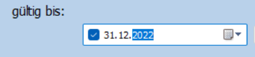
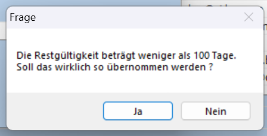

.. _LeklStatus:

.. index::
   single: LieferantenStatus

Erfassen des Status eines Lieferanten
=====================================

Zur Erfassung des Status kann das gleiche Formular, das zum Anfordern der Lekl dient, verwendet werden.
Es wird über das Menü "Lieferanten" Untermenü "Erklärungen anfordern/eingeben" aufgerufen.

Die Auswahl, des zu bearbeitenden Lieferanten erfolgt daher, wie unter :ref:`LeklAnfordernRef` beschrieben.

Formular Statuseingabe
----------------------

Alternativ kann für die Eingabe über das Menü "Lieferanten" 
Untermenü "Status prüfen/eingeben" das Formular **"Lieferantenstatus eingeben"** 
aufgerufen werden.

Dieses Formular ist bis auf die Filter identisch zum Formular **"Lieferantenerklärung anfordern"**.

Es werden generell nur Lieferanten angezeigt, die eine Anfrage erhalten haben.
Über die Filter kann eingestellt werden, ob 

- alle Lieferanten (Filter aus)
- nur Lieferanten deren Antwort schon erfasst wurde 
- oder umgekehrt, nur Lieferanten deren Antwort noch nicht erfasst wurde,

angezeigt werden.

Mit der Schaltfläche **Status** kann in beiden Formularen nach der Auswahl des Lieferanten, der Dialog zur Eingabe aufgerufen werden.

.. _StatusRef:

Status
------

Der Lieferanten-Status erfasst den generellen Zustand des Lieferanten bzgl. einer Lekl.
Dabei gibt es folgende Möglichkeiten:

#. **unbekannt**: Der Status wird vom System bei neuen Lieferanten, die nie angefragt wurden, vergeben. Er sollte **nie** vom Anwender vergeben werden.
#. **weigert sich**: Der Lieferant kann keine Lekl abgeben, oder will Geld dafür und wir verzichten. 
#. **alle Teile**: Der Lieferant bestätigt den EU-Ursprung für alle Teile, die er an uns liefert.
#. **einige Teile**: Der Lieferant bestätigt den EU-Ursprung für bestimmte Teile, die er an uns liefert.
#. **irrelevant**: Es wurde entschieden, diesen Lieferanten nicht um eine Lekl zu bitten. Ein Grund kann sein, dass er im Nicht-EU-Ausland sitzt oder das wir nicht mehr oder nur noch wenig bei ihm kaufen.

Der Status **irrelevant** wird vergeben, wenn der Lieferant nicht bzgl Lekl angefragt werden soll, obwohl er Pumpen- oder Ersatzteile liefert.
Durch Vergabe dieses Status wird diese bewusste Entscheidung dokumentiert.
Damit kann vermieden werden, das der Lieferant immer wieder in den Auswahllisten auftaucht, obwohl er keine Anfrage bekommen soll.
Bei Vergabe von **irrelevant** **sollte** auf jeden Fall eine Begründung im Formularfeld **Kommentar** abgegeben werden.

Status 2 bis 4 beschreiben die Rückmeldung des Lieferanten.

Sind in der abgegebenen Erklärung einzelne Teile aufgelistet, für die der Lieferant 
den EU-Ursprung garantiert, wird der Status **einige Teile** vergeben.

Bestätigt der Lieferant den EU-Ursprung, für alle Teile, die er an uns liefert, 
wird der Status **alle Teile** vergeben.

Nur in diesem Fall muss im weiteren Ablauf die Präferenzberechtigung für jedes einzelne Teil 
erfasst werden (:ref:`ErfassenTeilespezLekl`). In allen anderen Fällen ist die Erfassung für diesen Lieferanten abgeschlossen.

Die Erfassung des Status erfolgt über den folgenden Dialog:

.. image:: pics/StatusDialog.png
   :scale: 80 %
   :align: center

Im oberen rechten Formularbereich kann der zukünftige Status ausgewählt werden.
Links daneben wird der bisherige Stauts angezeigt.

Im Bereich **gültig bis** wird die bisher in der Datenbank hinterlegte Gültigkeit der Lekl angezeigt.
Hat der Lieferant eine neue Lekl abgegeben, **muss** dieses Datum aktualisiert werden.

In der Regel kann die Gültigkeit um 1 Jahr verlängert werden (Schaltfläche **+ 1 Jahr**).
Exakte Angaben eines anderen Datums können direkt in der Datumsanzeige erfolgen:

Hierzu kann z.B. die Jahreszahl, der Tag oder Monat angeklickt und überschrieben werden.

Die Datumseingabe ist bei den Status "**alle Teile**" und "**einige Teile**" erforderlich.
In diesen Fällen wird beim Verlassen des Formulars geprüft, ob die die Gültigkeit mindestens 100 Tage beträgt.
Ist dies nicht der Fall, wurde evtl vergessen, das Datum anzupassen und es erscheint eine Sicherheitsabfrage:

Wird die Frage mit **Nein** beantwortet, wird das Formular nicht geschlossen und das Datum kann korrigiert werden. 
Mit **Ja** werden die Angaben in die Datenbank übernommen.

Wird der Status **weigert sich** oder **irrelevant** gewählt, solltes die im Feld **Kommentar** begründet werden.
Der Kommentar kann auch im Hauptformular eingeben werden.

