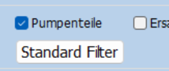

.. _ErfassenTeilespezLekl:

Erfassen der teilespezifischen Lieferantenerklärungen
=====================================================

Bei Lieferanten, die eine EU-Herkunft nur für einige der von ihnen gelieferten Teile bestätigen,
muss die Herkunft für jedes einzelne Teil in DigiLek erfasst werden.

Die Eingabe der teilespezifischen Lieferantenerklärungen wird über das Menü **"Teile/Status eingeben"**
gestartet. Hierzu wird zunächst der Lieferant ausgewählt, dessen Erklärung erfasst werden soll.

.. index::
   single: Lieferantenauswahl 

Auswahl eines Lieferanten zur teilespezifischen Eingabe
-------------------------------------------------------

.. image:: pics/Lekl3LieferantenAuswahl.png

Auch dieses Formular gliedert sich in die Bereiche "Filter", "gefiltert" und "gewählt".

Im Bereich Filter wird definiert, welche Lieferanten im Bereich gefiltert zur Auswahl angezeigt werden.

Der im Bereich "gefiltert" angewählte Lieferant wird mit Detailangaben im Bereich "gewählt" angezeigt.
Für diesen Datensatz werden dann die teilebezogenen Angaben gemacht.

Formular-Bereich Filter
^^^^^^^^^^^^^^^^^^^^^^^

Die Filter dienen dem leichteren Auffinden eines Lieferanten bzw. der Kontrolle,
welche Lieferanten noch zu bearbeiten sind.

Unabhängig von den Filtern werden nur Lieferanten zur Auswahl angeboten, die eine Lekl abgegeben haben,
bei denen diese Lekl noch eine ausreichende Restgültigkeit hat und die Herkunft nur 
für **einige Teile** (s. :ref:`StatusRef`) bestätigt.

Im linken Bereich kann über den Kurznamen oder den kompletten Namen gefiltert werden.
Dabei wird z.B. durch die Eingabe von *oduct* im Feld Name der Lieferant "B&P Products BVBA" gefunden.

Die Filter wirken alle gleichzeitig.
In der Überschrift des "gefiltert"-Bereichs wird jeweils angezeigt, wie viele Lieferanten den Kriterien entsprechen. 

Über die Schaltfläche mit dem durchkreutzten Filter-Symbol werden die Filter für Kurz-Name und Name gelöscht.

Bei den vier Filtern rechts, gibt es jeweils einen Filter und
den passenden Umkehrfilter dazu.

So werden über den Filter **nur aktuelle LEKL** nur Lieferanten angezeigt, die kürzlich (vor max 200 Tagen) eine Lekl abgegeben haben.
Hierdurch soll vermieden werden, das Eingaben für eine Erklärung gemacht werden,
die im Vorjahr abgegeben wurde, die aber noch für das Folgejahr gilt. Eine solche (2-Jahres)-Erklärung muss nicht aktualisert werden.

Der Umkehrfilter **nur alte LEKL** zeigt nur Erklärungen aus dem Vorjahr und sollte nur in Sonderfällen zur Recherche, aber nie zur Eingabe benutzt werden.

.. _FilterUnbearbeitet:

Der Filter **nur unbearbeitete** zeigt nur Lieferanten, für die noch keine Teile erfasst wurden.
Er sollte für die Eingabe gesetzt werden.

Der Umkehrfilter **nur bearbeitete** zeigt zu Kontrollzwecken nur Lieferanten, deren Teile schon erfasst wurden.

Über die Schaltfläche **"Standardfilter"** kann die sinnvolle Filterkombination zur Teilerfassung eingestellt werden.

Formular-Bereich gefiltert
^^^^^^^^^^^^^^^^^^^^^^^^^^

In diesem Bereich werden alle Lieferanten zur Auswahl angeboten, die den Filterkriterien entsprechen.

In der Überschrift des Bereiches wird die Anzahl dieser Lieferanten angezeigt.

In der Auswahl-Liste wird unter **gilt_bis** die Gültigkeit der Lekl angezeigt.

**Stand** zeigt das Datum, an dem die aktuelle Lekl grundsätzlich mit ihrem Status erfasst wurde.
Mit diesem Datum kann geprüft werden, ob die Lekl im Vorjahr oder in der aktuellen Erfassungsperiode eingegangen ist.

**StandTeile** wird beim Erfassen des teilebezogenen Status (s. :ref:`Speicherdatum`) auf das aktuelle Datum gesetzt

Weitere Detailangaben zu den in diesem Bereich angewählten Lieferanten, werden im Bereich **gewählt** angezeigt.

Formular-Bereich gewählt
^^^^^^^^^^^^^^^^^^^^^^^^

Dieser Bereich dient zur eigentlichen Bearbeitung des Lieferanten,
der im Bereich **gefiltert** ausgewählt wurde.

In der Bereichsüberschrift werden die UNIPPS-Lieferanten-Id und der Kurzname angezeigt.

Über die Schaltfläche **"Teile"** wird ein Formular geöffnet, 
in dem für jedes von diesem Lieferanten gelieferte Teil, die Angaben aus der Lekl eingetragen werden können. 

.. index::
   single: Präferenzkenner

.. _pfkSetzen:

Setzen der PFK-Flags
--------------------

.. image:: pics/TeilePFKeingeben.png

Im Kopfbereich des Formulars werden der Kurzname und die UNIPPS-Id des Lieferanten angezeigt.

Sortieren
^^^^^^^^^

Darunter befinden sich 3 Schaltflächen zum Sortieren der Teile-Liste.

Es kann sortiert werden nach:

- der Wernert Teilenummer
- der Wernert Teile-Benennung (Zeile 1)
- der Teilenummer des Lieferanten

Die Sortierung sollte so gewählt werden, dass sie mit der Erklärung des Lieferanten übereinstimmt.

Filtern
^^^^^^^

Unterhalb der Schaltflächen zum Sortieren befinden sich Textfelder zur Filtern nach:

- der Wernert Teilenummer
- der Wernert Teile-Benennung (Zeile 1)
- der Wernert Teile-Benennung (Zeile 2)
- der Teilenummer des Lieferanten

Die Eingabe von "dicht" zeigt z.B. alle Teile, deren Name diesen Text enthält.

Mit der Schaltfläche mit dem durchgekreuzten Filter können die Textfilter geleert werden.

Mit den Filtern **"Pfk 1"** und **"Pfk 0"** im rechten Bereich können Teile
gefiltert werden, der PFK gesetzt bzw nicht gesetzt ist.

Mit den Schaltflächen **"Alle Pfk 0"** und **"Alle Pfk 1"** werden die Kennzeichen aller Teile gesetzt bzw gelöscht. 

Da beim Erstaufruf des Formulars die Kennzeichen des Vorjahres angezeigt werden,
ist es **sinnvoll** zunächst alle Kenner zu **löschen**.

Teile-Liste
^^^^^^^^^^^

Unterhalb der Filter befindet sich die Liste der gefilterten Teile.

Direkt überhalb der Liste wird die Anzahl dieser Teile angezeigt.

In der Liste werden angezeigt:

- Wernert Teilenummer
- Wernert Teile-Benennung (Zeile 1)
- Wernert Teile-Benennung (Zeile 2)
- Teilenummer des Lieferanten
- Präferenzkennzeichen **PFK**

Das Präferenzkennzeichen kann durch anklicken in der geändert werden.

Ein sinnvoller Ablauf dabei ist es, die Erklärung des Lieferanten Teil für Teil durchzugehen und dabei die dort gelisteten Teile in geschicktes Setzen der Filter 
in der Auswahl-Liste zu finden und abzuhaken.

.. _Speicherdatum:

Das Speicherdatum
^^^^^^^^^^^^^^^^^

Die Daten werden bei jeder Änderung sofort in die Datenabk übertragen.

Beim Verlassen des Dialogs über **"OK"** erscheint jedoch eine Rückfrage,
ob die Bearbeitung dieses Lieferanten abgeschlossen ist oder später weitergeführt werden soll.

Ist die Bearbeitung abgeschlossen wird das aktuelle Datum in die Datenbank als **StandTeile** eingetragen.

Anhand dieses Datums wird entschieden, ob der Lieferant nach Setzen des Filters **"nur unbearbeitete"**
noch angezeigt wird oder nicht (s. :ref:`Filter nur unbearbeitete<FilterUnbearbeitet>`).
.

